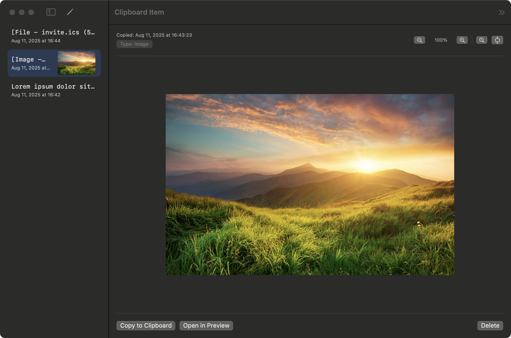
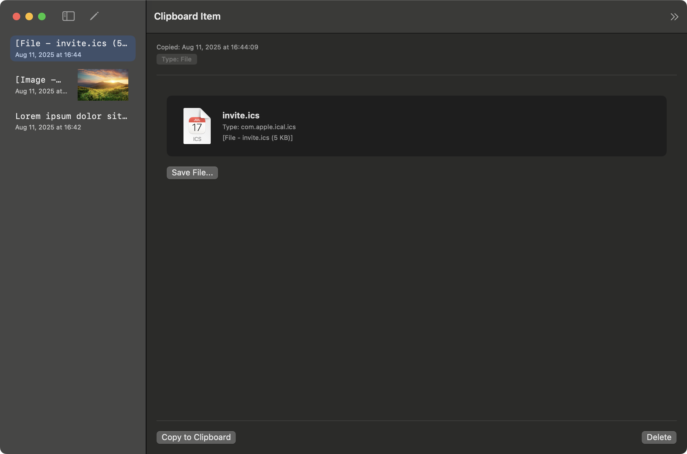
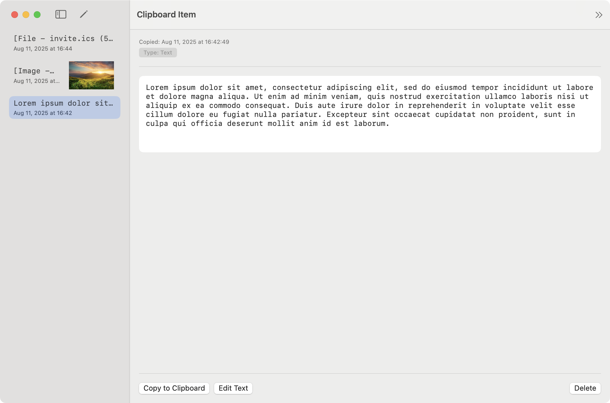
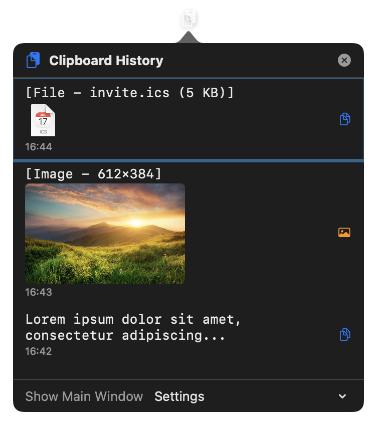

# StoneClipboarderTool

A macOS clipboard history manager that automatically saves and organizes everything you copy.

## 🔗 Links

- **Live Preview**: [https://foxfollow.github.io/Stone-Clipboarder-Tool/](https://foxfollow.github.io/Stone-Clipboarder-Tool/)
- **Latest Release**: [Download from GitHub](https://github.com/foxfollow/Stone-Clipboarder-Tool/releases/latest)

## Preview

## Features

- **Automatic Clipboard Monitoring**: Captures everything you copy while the app is running
- **Menu Bar Integration**: Quick access to recent 10 clipboard items from the menu bar
- **Native Settings**: Access settings through macOS app menu (⌘,) or menu bar
- **Persistent Storage**: Uses SwiftData to store clipboard history locally
- **Easy Access**: Browse and search your clipboard history in a clean interface
- **Quick Copy**: Click any item to copy it back to your clipboard
- **Smart Timestamp Update**: Reused items move to the top with updated timestamp
- **Smart Deduplication**: Avoids saving duplicate consecutive items
- **Bulk Operations**: Delete all clipboard history with confirmation dialog
- **Always Available Edit Mode**: Edit mode always visible for quick item management
- **Flexible UI Options**: Show/hide main window and menu bar independently

## How It Works

1. **Start the app** - Clipboard monitoring begins automatically
2. **Copy anything** - Text copied to your clipboard is automatically saved
3. **Browse history** - View all your clipboard items in chronological order
4. **Reuse content** - Click any item to copy it back to your clipboard
5. **Manage items** - Delete unwanted items using the edit mode

## Interface

### App Screenshots

<table>
  <tr>
    <td align="center">
       
      <b>Images View</b> How images look in the app with preview
    </td>
    <td align="center">
       
      <b>Files View</b> How files appear in clipboard manager
    </td>
  </tr>
  <tr>
    <td align="center">
       
      <b>Text View</b> How copied text content is displayed
    </td>
    <td align="center">
       
      <b>Menu Bar</b> Quick access to recent items
    </td>
  </tr>
</table>

### Main Window
- **Left Panel**: List of all clipboard items with preview and timestamp
- **Right Panel**: Detailed view of selected item with copy/delete actions
- **Toolbar**: Settings, edit mode toggle, and manual add button
- **Status Indicator**: Green dot shows clipboard monitoring is active

### Menu Bar
- **Quick Access**: Shows last 10 clipboard items
- **One-Click Copy**: Click any item to copy and move it to the top
- **Settings Menu**: Toggle main window and menu bar visibility
- **Direct Actions**: Show main window or quit from menu bar

## Usage Tips

- Items are automatically saved when you copy text from any application
- The most recent items appear at the top
- Use the monospaced font preview to quickly identify content
- Delete unwanted items by enabling edit mode
- The app continues monitoring clipboard changes while it's running

## Requirements

- macOS 15.0+
- Xcode 16.0+ (for building from source)

## Building

1. Open `StoneClipboarderTool.xcodeproj` in Xcode
2. Build and run the project
3. Grant any required permissions for clipboard access

The app uses SwiftUI and SwiftData for a modern, native macOS experience.
