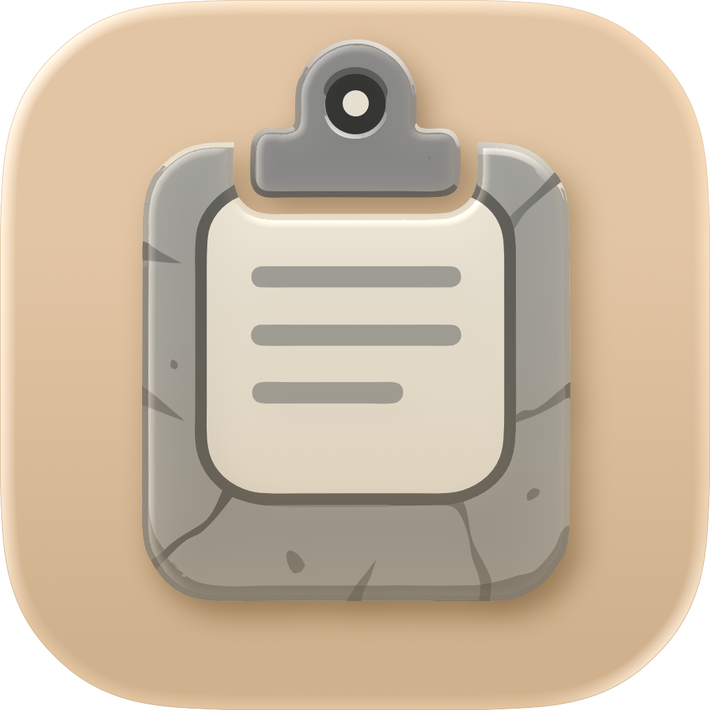
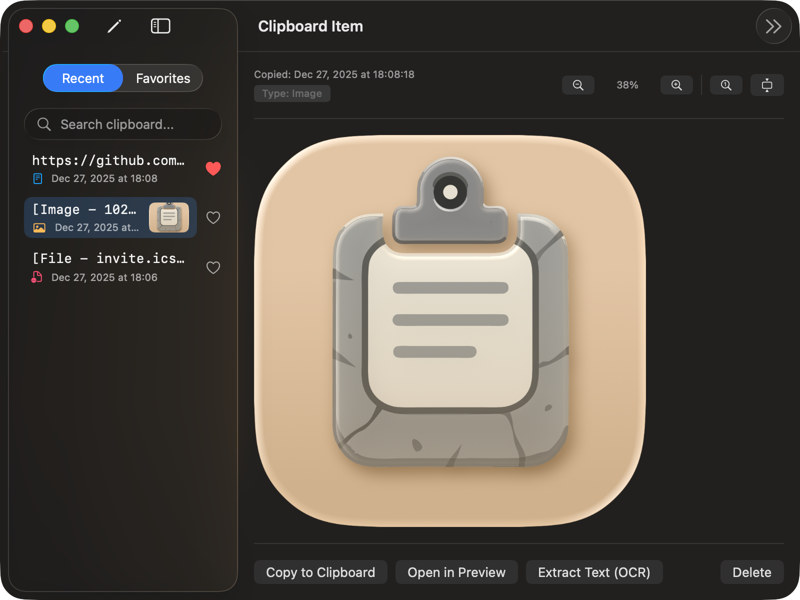
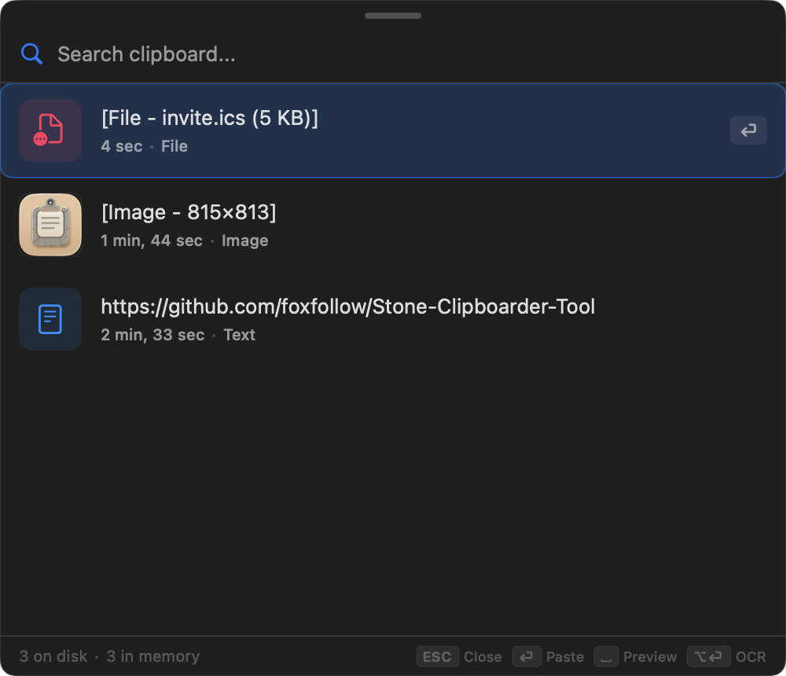
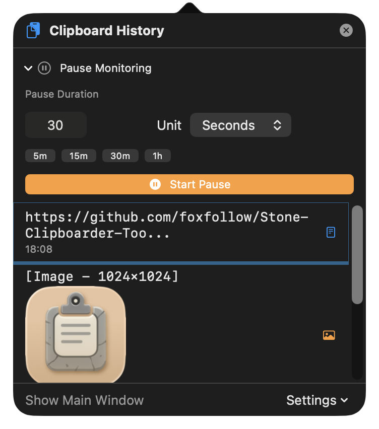

# Stone Clipboarder Tool

<div align="leading">

[](https://github.com/foxfollow/Stone-Clipboarder-Tool/actions/workflows/codeql.yml)
[](https://sonarcloud.io/summary/new_code?id=foxfollow_Stone-Clipboarder-Tool)

 <br>


</div>

<div align="center">



</div>

**Never lose anything you copy again.** Stone Clipboarder Tool is a free, open-source clipboard manager for macOS that automatically saves your entire copy-paste history. Access previously copied text and images instantly with global hotkeys, a Spotlight-like Quick Picker, or menu bar—all while keeping your data 100% private and stored locally on your device.

## Links

- **Live Preview**: [Visit site on GitHub Pages](https://foxfollow.github.io/Stone-Clipboarder-Tool/)
- **Latest Release**: [Download from GitHub](https://github.com/foxfollow/Stone-Clipboarder-Tool/releases/latest)
- **Installation Guide**: [Step-by-step installation instructions](https://foxfollow.github.io/Stone-Clipboarder-Tool/installation)


## Installation

### Homebrew (macOS)
```bash
brew tap foxfollow/stone
brew install stone-clipboarder-tool
```

The app will be automatically configured to run without security warnings.

[Homebrew tap](https://github.com/foxfollow/homebrew-stone)

### Manual Download
Download the latest `.zip` from [Releases](https://github.com/foxfollow/Stone-Clipboarder-Tool/releases)

If macOS blocks the app on first launch (common for non-App Store apps):
```bash
xattr -d com.apple.quarantine /Applications/StoneClipboarderTool.app
```
*See the [Installation Guide](https://foxfollow.github.io/Stone-Clipboarder-Tool/installation) for detailed steps.*

## Features

### 🆕 New in Version 1.8.0
- **🛠️ Whole-History Search**: Search in the Quick Picker and the main window now covers your whole history, not just the most recent items
- **🛠️ Quick Picker Scrolling**: The Quick Picker's All tab keeps loading past the first 150 items
- **🛠️ Main Window List**: Copying something new no longer collapses a scrolled main window list back to the top
- **🛠️ No More Duplicates**: Copying something that's already further down your history moves it to the top instead of saving it twice
- **🛠️ Hotkey Recording**: Hotkeys recorded with Return, Tab, arrows, F-keys or punctuation were saved but never worked. They work now, and ⇧⌘ system shortcuts are refused while recording
- **🛠️ File Paste**: A file copied back from your history can be pasted in Finder later, not only within five seconds
- **🛠️ Restored Pins**: Pins restored at launch show their pin badge again and close when their item is deleted; the Active Pins list in Settings updates right away
- **🛠️ Pin Moving and Image Zoom**: Unlocked pins can be moved again by dragging their header. Image pins fit and center in the window as you resize it, and zoom with a trackpad pinch or ⌘-scroll
- **🐛 Open Files**: "Open" on a non-image file in the Quick Picker opens the file, not a picture of its icon
- **🐛 Multi-Paste**: Pasting several items at once no longer saves the combined text as a new history item
- **🛠️ Remote Desktop Typing**: Type-out paste into remote desktops, virtual machines and terminals dropped Shift and Option — "FGH" arrived as "fgh" and "!@#" as "123". Modifiers are now pressed as real keys and held long enough for the remote side to see them
- **🛠️ Non-Latin Layouts**: With a non-Latin keyboard layout active (Ukrainian, Russian, …), type-out paste sent every Latin letter as "a" to apps that read key codes. Latin text now uses the keys of your ASCII layout
- **🐛 Keypad Keys**: Type-out paste no longer sends "*" and "+" from the numeric keypad, which the remote side could misread depending on its NumLock state
- **🛠️ Dock Icon**: With "Show Main Window" off, the app could still appear in the Dock after a restart when it launched at login
- **🛡️ Accessibility Hint**: Pasting with a hotkey without Accessibility permission now explains what's missing instead of silently doing nothing
- **✨ Smaller History**: Copied images are stored the way the source app provided them (often PNG) instead of as uncompressed TIFF, so screenshots take several times less space
- **🧹 Large Files**: Copying a very large file no longer freezes the app; files over 100 MB are skipped without being read
- **🧹 Snappier UI**: The Quick Picker opens faster with a large history, the menu bar draws its rows without decoding full images, and memory cleanup frees memory instead of deleting stored thumbnails
- **🛡️ Preview Cleanup**: Quick Look preview copies are deleted after 10 minutes and when the app quits, instead of staying up to an hour

**📖 [See the full changelog →](https://foxfollow.github.io/Stone-Clipboarder-Tool/version-history.html)**

### Core Features
- **Automatic Clipboard Monitoring**: Captures everything you copy while the app is running
- **Clipboard Capture Modes**: Choose to capture only text, only images, or both (useful for Microsoft Word text-only paste)
- **OCR Text Recognition**: Extract text from images using Apple Vision framework (Added in v1.2.0)
- **Combined Clipboard Items**: Save text and image as a single item (BETA - Added in v1.2.0)
- **Global Hotkeys**: System-wide keyboard shortcuts for instant clipboard access (⌃⌥1-0, ⌃⇧1-0)
- **Quick Picker Window**: Spotlight-like floating panel (⌃⌥Space) for fast item selection
- **Favorites System**: Keep frequently-used items; favorites are never auto-deleted
- **Pinned Windows**: Pin any item to the screen as a floating, always-on-top window (⌃⌥P pins the latest item)
- **Type-Out Paste**: ⌘⇧Return in the Quick Picker types text key by key, for fields and remote desktops that block pasting
- **Menu Bar Integration**: Quick access to your most recent items (5–50, configurable) from the menu bar
- **Native Settings**: Access settings through macOS app menu (⌘,) or menu bar
- **Persistent Storage**: Uses SwiftData to store clipboard history locally
- **Easy Access**: Browse and search your clipboard history in a clean interface
- **Quick Copy**: Click any item to copy it back to your clipboard
- **Smart Timestamp Update**: Reused items move to the top with updated timestamp
- **Smart Deduplication**: Copying something that's already in your history moves it to the top instead of saving it twice
- **Bulk Operations**: Delete all clipboard history with confirmation dialog
- **Flexible UI Options**: Show/hide main window and menu bar independently

## How It Works

1. **Start the app** - Clipboard monitoring begins automatically
2. **Copy anything** - Text copied to your clipboard is automatically saved
3. **Browse history** - View all your clipboard items in chronological order
4. **Reuse content** - Click any item to copy it back to your clipboard
5. **Manage items** - Delete unwanted items using the edit mode

## Interface

### App Screenshots

<table>
  <tr>
    <td align="center">
      <br>
      <sub><b>Main Window</b><br>Clipboard history with preview</sub>
    </td>
    <td align="center">
      <br>
      <sub><b>Quick Picker</b><br>Spotlight-like access (⌃⌥Space)</sub>
    </td>
    <td align="center">
      <br>
      <sub><b>Menu Bar</b><br>Quick access to recent items</sub>
    </td>
  </tr>
</table>

### Main Window
- **Left Panel**: List of all clipboard items with preview and timestamp
- **Right Panel**: Detailed view of selected item with copy/delete actions
- **Toolbar**: Settings, edit mode toggle, and manual add button
- **Status Indicator**: Green dot shows clipboard monitoring is active

### Menu Bar
- **Quick Access**: Shows last 10 clipboard items
- **One-Click Copy**: Click any item to copy and move it to the top
- **Settings Menu**: Toggle main window and menu bar visibility
- **Direct Actions**: Show main window or quit from menu bar

## Usage Tips

- Items are automatically saved when you copy text from any application
- The most recent items appear at the top
- Use the search bar to quickly find specific clipboard items
- Use the monospaced font preview to quickly identify content
- Delete unwanted items by enabling edit mode
- The app continues monitoring clipboard changes while it's running
- Exclude sensitive apps like password managers in Settings > Excluded Apps (v1.3.0+)
- Pause monitoring temporarily when working with sensitive data (v1.3.0+)

## Requirements

- macOS 15.0+
- Xcode 26+ (for building from source: the project uses an Icon Composer app icon and macOS 26 APIs behind availability checks)

## Building

1. Open `StoneClipboarderTool.xcodeproj` in Xcode
2. Build and run the project
3. Grant Accessibility permission when asked (needed to paste into other apps)

The app uses SwiftUI and SwiftData for a modern, native macOS experience.

Unit tests run inside the app but against in-memory stores and throwaway settings, so they never touch your real history:

```bash
xcodebuild test -project StoneClipboarderTool.xcodeproj -scheme StoneClipboarderTool -destination "platform=macOS"
```

Manual checks per feature are in [TESTING_GUIDE.md](TESTING_GUIDE.md); contributor and agent notes are in [AGENTS.md](AGENTS.md) and [docs/CODEMAP.md](docs/CODEMAP.md).

## Version History

[View Full Version History](https://foxfollow.github.io/Stone-Clipboarder-Tool/version-history.html)

## License
The MIT License (MIT)

Copyright © 2025 Heorhii Savoiskyi d3f0ld@proton.me