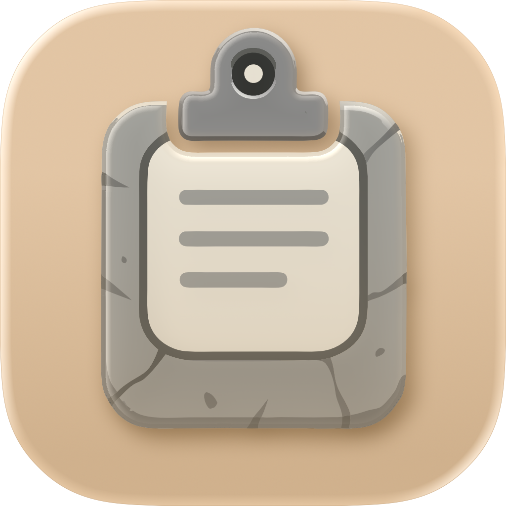

# Stone Clipboarder Tool

<div align="leading">

 <br>


</div>

<div align="center">



</div>

A macOS clipboard history manager that automatically saves and organizes everything you copy.

## Links

- **Live Preview**: [Visit site on GitHub Pages](https://foxfollow.github.io/Stone-Clipboarder-Tool/)
- **Latest Release**: [Download from GitHub](https://github.com/foxfollow/Stone-Clipboarder-Tool/releases/latest)
- **Installation Guide**: [Step-by-step installation instructions](https://foxfollow.github.io/Stone-Clipboarder-Tool/installation)


## Installation

### Homebrew (macOS)
```bash
brew tap foxfollow/stone
brew install stone-clipboarder-tool
```

The app will be automatically configured to run without security warnings.

[Homebrew tap](https://github.com/foxfollow/homebrew-stone)

### Manual Download
Download the latest `.zip` from [Releases](https://github.com/foxfollow/Stone-Clipboarder-Tool/releases)

If macOS blocks the app on first launch (common for non-App Store apps):
```bash
xattr -d com.apple.quarantine /Applications/StoneClipboarderTool.app
```
*See the [Installation Guide](https://foxfollow.github.io/Stone-Clipboarder-Tool/installation) for detailed steps.*

## Features

### 🆕 New in Version 1.3.2
- **✨ Enhanced Quick Picker**: Improved window isolation and accessibility integration
- **🎯 Smart Focus**: Search field automatically takes focus for immediate typing
- **🐛 Bug Fixes**: Stability improvements and optimizations

[View Full Version History](https://foxfollow.github.io/Stone-Clipboarder-Tool/version-history.html)

### Core Features
- **Automatic Clipboard Monitoring**: Captures everything you copy while the app is running
- **Clipboard Capture Modes**: Choose to capture only text, only images, or both (useful for Microsoft Word text-only paste)
- **OCR Text Recognition**: Extract text from images using Apple Vision framework (Added in v1.2.0)
- **Combined Clipboard Items**: Save text and image as a single item (BETA - Added in v1.2.0)
- **Global Hotkeys**: System-wide keyboard shortcuts for instant clipboard access (⌃⌥1-0, ⌃⇧1-0)
- **Quick Picker Window**: Spotlight-like floating panel (⌃⌥Space) for fast item selection
- **Favorites System**: Pin frequently-used items that are protected from auto-deletion
- **Menu Bar Integration**: Quick access to recent 10 clipboard items from the menu bar
- **Native Settings**: Access settings through macOS app menu (⌘,) or menu bar
- **Persistent Storage**: Uses SwiftData to store clipboard history locally
- **Easy Access**: Browse and search your clipboard history in a clean interface
- **Quick Copy**: Click any item to copy it back to your clipboard
- **Smart Timestamp Update**: Reused items move to the top with updated timestamp
- **Smart Deduplication**: Avoids saving duplicate consecutive items
- **Bulk Operations**: Delete all clipboard history with confirmation dialog
- **Flexible UI Options**: Show/hide main window and menu bar independently

## How It Works

1. **Start the app** - Clipboard monitoring begins automatically
2. **Copy anything** - Text copied to your clipboard is automatically saved
3. **Browse history** - View all your clipboard items in chronological order
4. **Reuse content** - Click any item to copy it back to your clipboard
5. **Manage items** - Delete unwanted items using the edit mode

## Interface

### App Screenshots

<table>
  <tr>
    <td align="center">
      <br>
      <sub><b>Main Window</b><br>Clipboard history with preview</sub>
    </td>
    <td align="center">
      <br>
      <sub><b>Settings</b><br>Customization options</sub>
    </td>
  </tr>
  <tr>
    <td align="center">
      <br>
      <sub><b>Quick Picker</b><br>Spotlight-like access (⌃⌥Space)</sub>
    </td>
    <td align="center">
      <br>
      <sub><b>Menu Bar</b><br>Quick access to recent items</sub>
    </td>
  </tr>
</table>

### Main Window
- **Left Panel**: List of all clipboard items with preview and timestamp
- **Right Panel**: Detailed view of selected item with copy/delete actions
- **Toolbar**: Settings, edit mode toggle, and manual add button
- **Status Indicator**: Green dot shows clipboard monitoring is active

### Menu Bar
- **Quick Access**: Shows last 10 clipboard items
- **One-Click Copy**: Click any item to copy and move it to the top
- **Settings Menu**: Toggle main window and menu bar visibility
- **Direct Actions**: Show main window or quit from menu bar

## Usage Tips

- Items are automatically saved when you copy text from any application
- The most recent items appear at the top
- Use the search bar to quickly find specific clipboard items
- Use the monospaced font preview to quickly identify content
- Delete unwanted items by enabling edit mode
- The app continues monitoring clipboard changes while it's running
- Exclude sensitive apps like password managers in Settings > Excluded Apps (v1.3.0+)
- Pause monitoring temporarily when working with sensitive data (v1.3.0+)

## Requirements

- macOS 15.0+
- Xcode 16.0+ (for building from source)

## Building

1. Open `StoneClipboarderTool.xcodeproj` in Xcode
2. Build and run the project
3. Grant any required permissions for clipboard access

The app uses SwiftUI and SwiftData for a modern, native macOS experience.

## Version History

[View Full Version History](https://foxfollow.github.io/Stone-Clipboarder-Tool/version-history.html)

## License
The MIT License (MIT)

Copyright © 2025 Heorhii Savoiskyi d3f0ld@proton.me